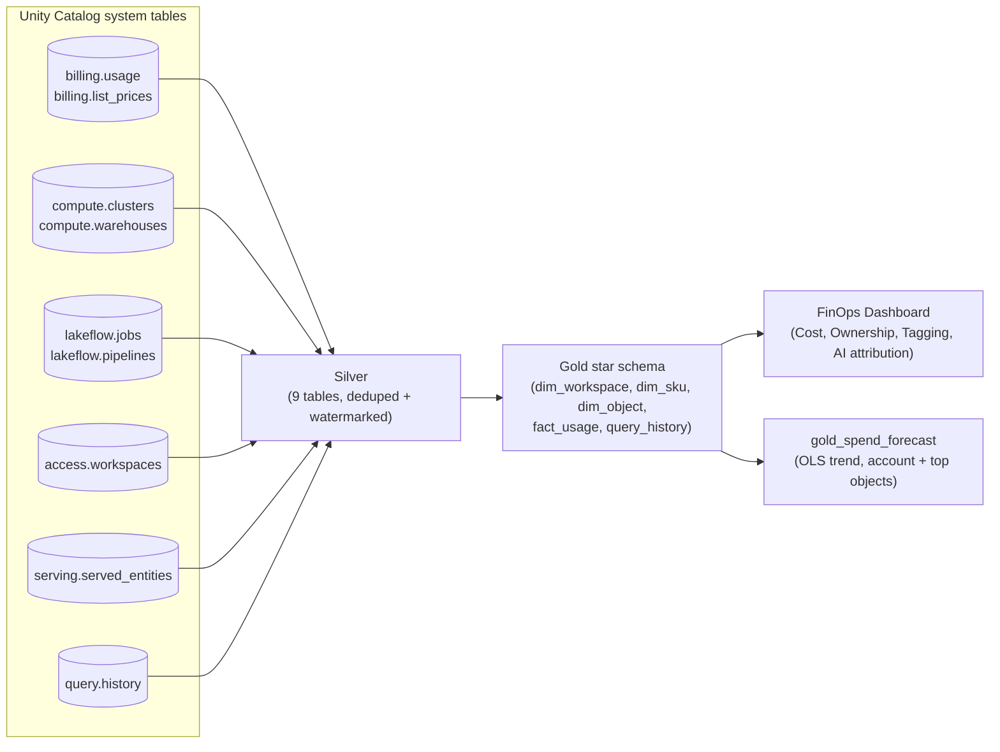
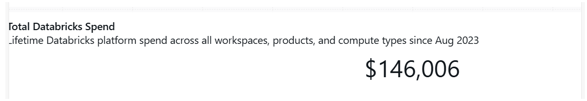
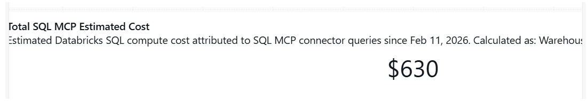
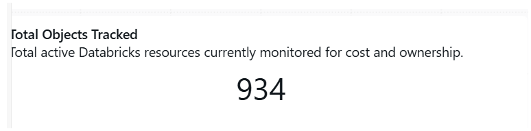
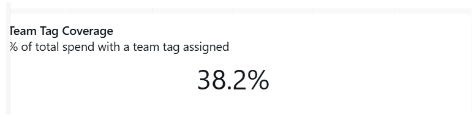

# Databricks Cost Analytics & FinOps Framework

**A FinOps pipeline that turned three years of scattered platform billing data into a governed cost model — and caught a 2x measurement error in an AI cost-attribution methodology before it ever reached a stakeholder.**

During a Data Engineering internship at a construction industry firm, I designed and built a Databricks cost analytics pipeline from Unity Catalog system tables — the platform's own billing, compute, and query telemetry — into a star schema powering a FinOps dashboard used by leadership and team leads. The code in [`notebooks/`](notebooks/) — including the Databricks Asset Bundle job configs — is the real implementation, with identifying details masked or genericized — see [Masking notes](#masking-notes).

| $146K | 85.6% | ~95% | $462 | 2x |
|:---:|:---:|:---:|:---:|:---:|
| lifetime platform spend brought under a governed cost model | of that spend had no identifiable owner | of tracked resources idle 90+ days, still accruing cost | in AI query cost attributed and validated | overstatement in the AI-cost methodology, caught and corrected before it reached a stakeholder |

**Contents:** [Business impact](#business-impact) · [Before / after](#before--after) · [Problem](#problem) · [How it works](#how-it-works) · [Dashboard](#dashboard) · [Masking notes](#masking-notes) · [Skills demonstrated](#skills-demonstrated)

## Business impact

- Brought **$146,006 in lifetime Databricks platform spend** under a governed, queryable cost model — replacing a native dashboard that only showed the trailing 90 days with a star schema covering the platform's full multi-year billing history back to account inception.
- Surfaced that **85.6% of that spend — roughly $125,000 — had no identifiable owner**: no team, no individual, nobody accountable. Built a priority-ordered identity-resolution chain (query executor → resource creator → resource owner) against six different, individually unreliable source fields to make that number visible and trackable as a standing KPI, not a one-time finding.
- Identified that **the large majority of actively-tracked compute resources (888 of 934) had been idle for 90+ days** while still capable of accruing cost — turning "we don't know what we're paying for" into a concrete, ranked cleanup list surfaced directly on the dashboard.
- Extended the pipeline to attribute AI assistant (Claude) query cost by pro-rata compute-time share, validating **$462 in attributed cost** over a 4-month window — and **caught a 2x measurement error during methodology review**: an earlier monthly-grain calculation would have reported **$904**, nearly double the correct figure, caught and fixed before it was ever presented as fact.
- Designed the ownership and tag-coverage model as the pipeline's core FinOps KPI, not an afterthought — team tag coverage sat at just **38.2%** and purpose tag coverage at **12.1%** at time of measurement, both now tracked continuously as spend-weighted percentages so cost accountability gaps can't silently regrow.
- Handled real production scale cleanly: **268,000+ billing records and 1.85M+ query executions**, both confirmed 100% unique with zero duplicates after load — validated by an idempotency check that reruns the pipeline and confirms zero row drift.

### Before / after

| | Before | After |
|---|---|---|
| **Spend visibility** | Native dashboard showed only the trailing 90 days | $146,006 in full lifetime spend, in a governed, queryable star schema |
| **Ownership** | No systematic way to know who owned a cost object | Priority-ordered identity resolution; unresolved spend cut from unmeasured to a tracked, visible $125K (85.6%) |
| **Idle resource detection** | No idle-resource visibility at all | Idle-day-count computed per object; 888 of 934 tracked resources (~95%) flagged idle 90+ days, ranked by spend |
| **AI cost attribution** | Not measured | Pro-rata attribution by compute-time share; $462 validated, a $904 methodology error caught before reporting |
| **Tag governance** | Tagging compliance unmeasured | Team (38.2%) and purpose (12.1%) tag coverage tracked as a spend-weighted %, with an untagged-spend drill-down |
| **Data quality confidence** | Raw system tables re-deliver full config history on every extract (stale re-delivery) | Deduplicated via `ROW_NUMBER()` + `change_timestamp`, validated with a post-load uniqueness check on every run |

## Problem

The organization's Databricks platform spend had grown for three years with no dedicated cost model — the only visibility was Databricks' own built-in usage dashboard, which only surfaces a 90-day rolling window and can't answer basic FinOps questions: which team is spending what, which resources are idle, or who owns a given cost. Every one of those questions required a manual, one-off query against raw system tables.

## How it works

The engineering behind the impact above:

**Pipeline design:**
- **No bronze layer.** System tables are already Unity Catalog-native — the pipeline reads directly from source with no ingestion step, going straight to a normalized silver layer.
- **Two load patterns, chosen per source characteristic** ([`docs/load_patterns.md`](docs/load_patterns.md)): append-with-watermark for immutable history tables (billing, query history — confirmed 0 duplicates across 268K+ and 1.85M+ rows respectively), and full-overwrite-with-dedup for metadata tables that re-deliver their entire configuration history on every extract (clusters, warehouses, jobs, pipelines — one table had an 85% duplicate rate in the raw extract).
- **Owner attribution via a COALESCE priority chain** ([`3.0_gold_databricks_analytics.sql`](notebooks/3.0_gold_databricks_analytics.sql)): `executed_by_identity → creator_email → creator_identity → owner_email → UNRESOLVED`, because no single source field reliably carries a human-readable owner across every resource type.
- **Deterministic surrogate keys via `xxhash64`**, not auto-increment — auto-increment would regenerate on every full-rebuild and silently break every downstream fact-table join.
- **Partition-selective DELETE + INSERT** on the two large fact tables (`gold_fact_usage`, `gold_query_history`), because Databricks Serverless SQL Warehouses don't support Spark's native partition-overwrite mode — only the daily watermark window is touched, leaving years of historical partitions untouched.
- **AI query cost attribution**, added as an extension: Claude queries are identified by client-application string in the dashboard layer (no derived pipeline column, so a new client string is a dashboard-only change), and cost is attributed pro-rata by `total_task_duration_ms` — the true parallel-compute measure, not wall-clock, which the methodology review found overstates Claude's real cost by roughly 23%.
- **Spend forecasting** ([`4.0_gold_spend_forecast.py`](notebooks/4.0_gold_spend_forecast.py)), a later addition to the same pipeline: an ordinary-least-squares regression fit to the trailing 90 days of `gold_daily_spend_trend`, both account-wide and for the top cost objects by lifetime spend (skipping any object with fewer than 14 days of billing activity in the window — not enough points for a trend to mean anything). The fitted rate is annualized into a low/mid/high band using the regression's residual standard deviation, replacing the manual "compare a few rolling averages by eye" approach from the initial EDA with a repeatable, scheduled task in the same job. It supersedes, and is consistent with, the $53K–$57K range that first surfaced from that manual EDA pass.
- **CI** ([`.github/workflows/ci.yml`](.github/workflows/ci.yml)) lints every notebook and validates both job configs against a schema — catching a broken task dependency or a missing required field before it would fail at `databricks bundle deploy` time.

Full technical write-up — every table's grain, load pattern, and design rationale: [`docs/table_designs.md`](docs/table_designs.md) and [`docs/load_patterns.md`](docs/load_patterns.md).

## Dashboard

A six-tab FinOps dashboard reads from the gold layer — Cost Summary, AI Query Cost, Object Ownership, Tagging & Attribution, an App Cost breakdown, and a README tab documenting the methodology for every metric. KPI tiles from four of those tabs, cropped from the live dashboard:

<table>
<tr>
<td></td>
<td></td>
</tr>
<tr>
<td></td>
<td></td>
</tr>
</table>

Full tab layout (widgets, filters, and every underlying SQL query): [`docs/dashboard-reference.md`](docs/dashboard-reference.md).

## Masking notes

This is the real implementation, not a rebuilt demo — so before publishing, I removed or genericized everything that isn't mine to share:

| Removed | Replaced with |
|---|---|
| Real vendor/employer name (appeared throughout) | Generic "the organization" / "the client organization" |
| Real reviewer name, appearing as a decision-owner throughout the design docs | Generic "Data + Automation Team" / "the reviewer" |
| Real service-principal UUID, budget-policy UUID, and warehouse ID | Placeholder values (`<SERVICE_PRINCIPAL_ID>`, etc.) |
| Real Databricks workspace/account IDs | Placeholder values (`<PROD_WORKSPACE_ID>`, `<DEV_WORKSPACE_ID>`) |
| Jira ticket numbers | Removed from comments |
| Links to the employer's private GitHub repo | Placeholder repo URL |

Catalog and schema names (`data_automation.databricks_analytics`) are the real internal names — they're generic labels, not identifying information. The load-pattern logic, star-schema design, and attribution methodology are unmodified — that's the part that's actually mine to show.

Left out of this repo entirely: the EDA presentation deck, data dictionaries, and exploratory notebooks — those carry real colleague names/emails and more granular findings than I could responsibly launder line-by-line. Their key findings are already reflected in the Business Impact section above.

## Skills demonstrated

`Databricks` · `PySpark` · `SQL` · `Python` · `Databricks Asset Bundles` · `Unity Catalog` · `Star schema design` · `FinOps / cost governance` · `Data pipeline architecture (silver/gold)` · `CI/CD for data pipelines` · `Statistical forecasting (OLS regression, NumPy)`
